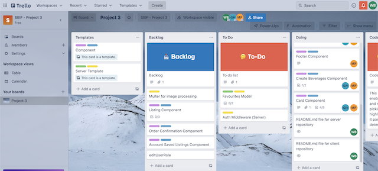
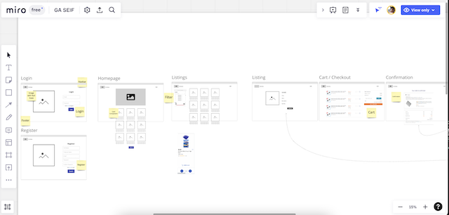
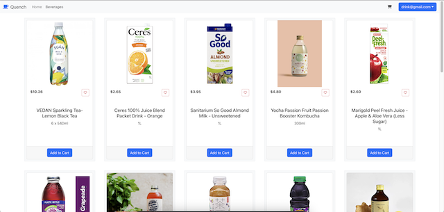
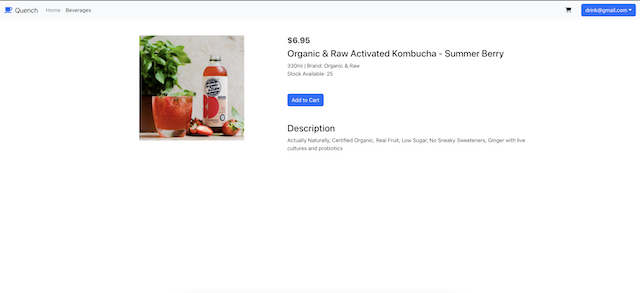

# Quench E-commerce (client)

## Technologies used:

This group project consist of 2 repositiories, the client(Frontend) and server(Backend) and the Technologies comprises of the MERN stack: Mongoose, Express, React and NodeJS. This is the client repository. For more information on the server repository, click [here](https://github.com/muffinthepao/quench-server)!

## Project concept:
The idea for this project was to create an E-commerce website for the purchase and sales of beverages, where the owner of the website is the bulk supplier of different types of beverages and buyers are able to purchase them. 

## Approach taken:
Due to working in a team of 3 members for this group project, some form of coordination is required. Trello, a project tracker app, was used to assist the team in organizing our project workflow and task delegation.

Miro, a whiteboarding platform, was used to help the team in visualizing how the website should look like by creating the wireframe during the project consultation phase and also as a reference point throughout the duration of the project.

Frequent Stand-ups were also organized to keep track of the project progess, discussion on what have been done by each members and to solve any issues faced by any team members.

The main objective of completing the project was to first determine and meet the Minimum Viable Product (MVP) requirements set for this project. Further improvements to the website will only be worked on after achieving a proper working app with its bugs / issues solved. The MVPs are:
+ working full-stack app using MERN stack
+ adhere to MVC file structure for server repository and conventional components and pages file structure for client repository
+ at least one model with full CRUD
+ include two features requirement (Authorization, Two models and Related models acheived)
+ Be deployed online and accessible to the public. Click [here](heroku link here...) to access!
+ usage of daily tracker (Trello, Miro)
+ Readme.md file present in both repositories

## Future improvements (Stretch goals):

Though the website was completed with minimum viable product achieved, the following unsolved problems and will be worked on as future stretch goals:
+ implementation of admin users
+ create, update and delete beverage items as admin
+ saved listings page for users
+ order history page for users
+ authmiddleware for both client and server
+ more user friendly addToCart and UpdateCart functions

